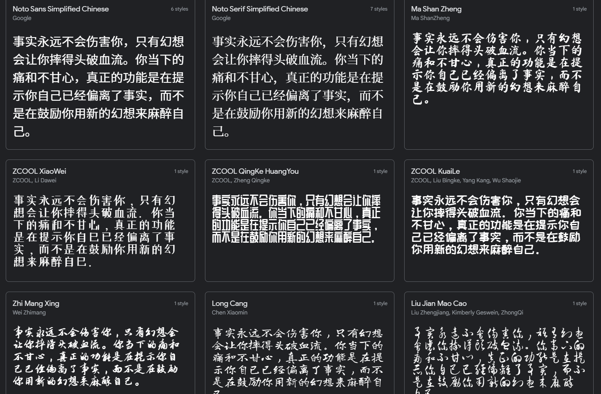

本项目用于精简字体文件，并提供在线服务

由于中文汉字较多，导致字体文件一般都有3-10M，但网页往往只会用到部分文字，为了这些字导致网页加载缓慢实属不划算

使用本项目您可以指定使用的字体和需要被渲染的文字，我们返回一个被精简过的字体文件，一般就只有几kb大小了

### 使用方法

注：该使用方法是调用我提供的在线服务，您也可以按下文说明自己搭建

#### 引入js

1. 引入js
2. 调用cropFont(elementId)方法

注1：调用该方法需要给需要使用字体的元素加上id

注2: 字体名字怎么传下方有说明

示例：

```html
<div id='hi'>中国人民从此站起来了</div>


<script type="text/javascript" src="https://webfont.woyou.cool/huntzou_webfont_crop.js"></script>
<script>
window.onload = function() {
    cropFont("hi", "MaShanZheng-Regular.ttf");
    // 支持同时给不同的标签使用不同的字体
    //cropFont("id2", "LiuJianMaoCao-Regular.ttf");
}
</script>
```


该字体文件原本有5M多，现精简为6k（只包含了指定的汉字所以很小）

#### 调用接口

可以直接调用接口：

1. 获取裁剪后的字体文件

注：font_family 的值需使用api获取，不能随便填写。output_font_type (输出文件类型) 目前仅支持 mtx、eot、woff、ttl

> GET https://webfont.woyou.cool/crop?crop_text=abc&output_font_type=woff&font_family=MaShanZheng-Regular.ttf

2. 获取支持的字体

> GET https://webfont.woyou.cool/ls

目前支持这9种字体




### 自己部署
这就是一个基于springboot的web service。

如需自己部署服务，您可能需要修改以下地方：

1. resources/static/huntzou_webfont_crop.js （必须）


2. dockerfile （可选）


这个地方更一般的做法是将本机的字体文件夹挂载进容器，我这里就直接将所有字体拷贝进去了。


### docker

1. 先编译项目得到jar包（build/libs/webfont-0.0.1-SNAPSHOT.jar），将jar包拷贝到项目根目录（dockerfile同级目录）
2. 项目根目录下执行docker编译命令。`docker build -t huntzou/webfont .`

### sfntly

本项目完全基于sfntly，一个google的开源项目，本身就有有字体文件裁剪功能

我只是将他的代码拷下来做成了一个web服务而已

https://github.com/googlefonts/sfntly


### 字体来源

本项目根目录下的fonts文件夹有一些现成的字体，均来源于 google font

https://fonts.google.com/